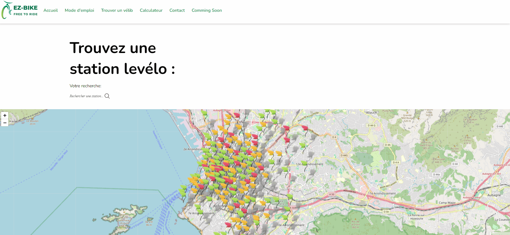

# 🚲 e-z-bike Project

## 🚀 Application Deployment

### 📂 File Description

#### 📄 HTML

Each HTML file (`index.html`, `modeEmploi.html`, `trouver-un-velib.html`, `calculateur.html`, `contact.html`, `comingSoon.html`, `error404.html`) contains the content for its respective page with the necessary HTML tags.

#### 🎨 CSS

- `common.css`: For general site styles.
- `contact.css`: For specific styles related to the responsive version of the site.

#### ⚡ JavaScript

- `common.js`: For general site functionalities.
- `carousel.js`: To implement the carousel on the User Guide page.
- `trouver-un-velib.js`: To manage station search on the map for the "Find a Bike" page.
- `contact.js`: For form validation on the Contact page.
- `form.js`: For the CO2 emissions calculator.
- `compteRebours.js`: For the countdown timer.

### 🌐 Main Pages

#### 🏠 Home Page (index.html)

The homepage includes two buttons redirecting to the `calculateur.html` and `trouver-un-velib.html` pages, as well as "How it works?" and "Go to station" sections.

#### 🍔 Navigation Bar & Burger Menu

The top navigation bar on every page includes links to all site pages: "Home", "User Guide", "Find a Bike", "Calculator", "Contact", and "Coming Soon". A responsive burger menu is also available.

#### 🧮 Calculator Page (calculateur.html)

The calculator page features a form where users can enter kilometers traveled per day and workdays per week. A pop-up displays CO2 levels for car commuting and the result in kg of CO2 emissions rejected per month.

#### 🗺️ Find a Bike Page (trouver-un-velib.html)

This page includes a search bar with an interactive map to find Velib stations based on user input and station location. Map icons are shaped like leaves 🍃 to reflect the site's eco-friendly nature.

#### 📧 Contact Page (contact.html)

On this page, users can enter their first name, last name, phone number, email, and a message. JavaScript regular expressions (Regex) are used to validate each form category. A submit button allows sending the form.

#### ⏳ Coming Soon Page (comingSoon.html)

A simple page with a countdown timer set for the arrival of a new page or feature.

#### 🚫 404 Error Page (error404.html)

A 404 error page for redirection if no page is found.
